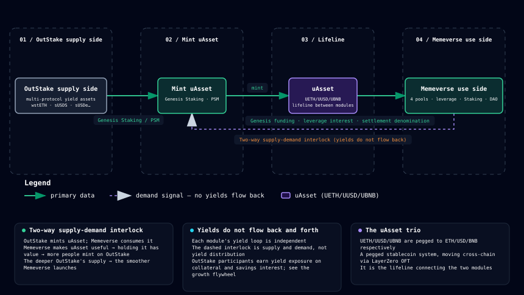

# Outrun

> Unify yield-bearing assets. Launch on-chain consensus.

Outrun is an omnichain DeFi ecosystem built from two modules that drive each other:

- **OutStake** — yield infrastructure. It unifies yield-bearing assets from Aave, Lido, Sky, Ethena, Lista, Aster, and other protocols, and mints them into the pegged stablecoins **uAsset** (UETH / UUSD / UBNB).
- **Memeverse** — the omnichain community consensus launcher. Standard, leveraged, and Preorder participation converge on a single fair launch; the Memecoin goes live with four-pool liquidity, splittable and tradable PT/YT, staking yield, and DAO governance.

The two modules are not simply parallel — **uAsset is the lifeline connecting them**. OutStake mints uAsset; Memeverse consumes it in Genesis and leverage. The two modules interlock through uAsset supply and demand. Capital gets recycled inside the loop instead of sitting idle in isolated pools.

---

## OutStake — unifying yield-bearing assets into stablecoins

Yield-bearing tokens from different protocols (aToken, wstETH, sUSDS, sUSDe…) each go their own way, fragmenting both yield and liquidity. OutStake unifies them behind a standardized interface and mints them into uAsset stablecoins that circulate across chains.

Three ways to participate:

- **Genesis Staking**: deposit yield-bearing assets and mint uAsset at their current face value (an amount equal to your principal). The minted uAsset goes straight into Memeverse Genesis. Your collateral keeps earning, and the exposure stays entirely with you. No interest, no liquidation, no lock-up; the position can be redeemed anytime.
- **PSM swap**: use reserve assets such as USDC, USDT, ETH, or BNB to swap directly into uAsset at 1:1 par through a reserve-backed pool. No position, no debt.
- **USR savings**: deposit idle uAsset into the savings vault to earn interest, with deposits and withdrawals anytime.

See the [OutStake overview](outstake/README.md).

## Memeverse — where community consensus grows into a nation

Memeverse lets anyone launch a Memecoin on multiple chains at the same time, with three engines in place the moment it goes live:

- **Fair launch**: no Creator privileges, no pre-allocation. Standard, leveraged, and Preorder participation converge on the same fair Genesis; once the threshold is reached, the four pools are created and the primary pool is locked for 365 days.
- **Yield tokenization**: the locked primary-pool liquidity is split into PT (principal) and YT (yield), turning future cash flows into assets that can be traded today; the POLend market (leveraged Genesis) is built on this split.
- **Staking and DAO governance**: trading fees flow to stakers and the community treasury; stake and delegate to gain governance rights, and the community claims epoch rewards.

See the [Memeverse overview](memeverse/README.md).

---

## uAsset: the lifeline connecting the two modules

uAsset (UETH / UUSD / UBNB) is Outrun's pegged stablecoin system. The three tokens are pegged to ETH, USD, and BNB respectively, and they move across chains via LayerZero OFT:

- On the OutStake side: stake yield-bearing assets to mint uAsset.
- On the Memeverse side: uAsset is consumed as Genesis funding, leverage interest, and the payment currency for GenesisCredit.
- The two modules interlock: Memeverse makes uAsset useful → holding it has value → more people mint on OutStake; deeper supply from OutStake → smoother launches on Memeverse. **Yields do not flow back and forth between the modules**; each side runs its own independent loop (see the [growth flywheel](ecosystem/flywheel.md)).

Through uAsset, earning yield and launching a token are no longer two separate things; they are the two ends of one capital cycle.

---

## How to read this book

| You are | Suggested path |
|---|---|
| New to Outrun | This page → [Product vision](vision.md) → [OutStake overview](outstake/README.md) → [Memeverse overview](memeverse/README.md) |
| Looking to stake or mint uAsset | The [OutStake](outstake/README.md) chapters |
| Looking to launch or join a Memecoin | The [Memeverse](memeverse/README.md) chapters |
| Interested in the ecosystem's economic model | [Growth flywheel](ecosystem/flywheel.md) → [Business model](ecosystem/business-model.md) |
| Comparing similar products | [vs Pump.fun](memeverse/vs-pump-fun.md) |
