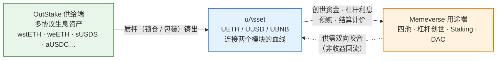

# Outrun

> 统一生息资产，启动链上共识。

Outrun 是一个全链 DeFi 生态，由两个互为驱动的模块组成：

- **OutStake** —— 收益基础设施。把 Aave、Lido、EtherFi、Sky、Ethena、Lista、Aster 等多协议的生息资产统一，铸成锚定型稳定币 **uAsset**(UETH / UUSD / UBNB)。
- **Memeverse** —— 全链社区共识启动器。它启动的不是一枚代币，而是一个拥有流动性、收益与治理的链上社区：四池流动性、动态费率、杠杆创世、Memecoin Staking 与 DAO 治理，让 Memecoin 从投机符号长成一个能自我维持的社区国度。

两个模块并非简单并列 —— **uAsset 是连接它们的血线**：OutStake 铸造 uAsset，Memeverse 在创世与杠杆中消耗 uAsset，两端通过 uAsset 的供需互相咬合。资本在闭环里被反复利用，而不是躺在 isolated 的池子里。

---

## OutStake — 把生息资产统一成稳定币

不同协议的生息代币（aToken、wstETH、weETH、sUSDS、sUSDe……）各自为政，收益和流动性都被切碎。OutStake 用一层标准化接口把它们统一，铸成可在全链流通的 uAsset 稳定币。

两种参与方式：

- **锁仓质押（Lock）**：存入生息资产即按当前价值铸出 uAsset 稳定币（本金等值）供你使用，本金继续生息；你可在锁仓期内随时把新增值再提取成 uAsset，到期后赎回本金。
- **包装质押（Wrap）**：进入共享池，无锁定期，存入即铸出可自由转让的 uAsset，适合当稳定币流通使用。

锁仓到期忘了赎也没关系 —— 锁定超时达到一定时间后，协议会代为赎回仓位（keeper 机制），本金等值部分由协议回收，增值收益归你。

详见 [OutStake 概览](outstake/README.md)。

## Memeverse — 让社区共识长成一个国度

Memeverse 不是发币工具，而是**全链社区共识启动器**：它启动的不是一个 Memecoin，而是一个拥有流动性、收益与治理的链上社区。任何人都能在多条链上同时启动一个 Memecoin，但它上线即同时拥有三套引擎 —— 从投机符号，变成一个能自我维持的社区国度：

- **四池流动性 + 动态费率**：启动即建立深度、抗抢跑抗夹的流动性，而不是单一稀薄池子。
- **杠杆创世（POLend）**：用 uAsset 或创世积分支付利息，放大创世参与，到期统一结算。
- **Memecoin Staking + DAO 治理**：交易手续费流入收益库给质押者发收益；Memecoin 同时成为 DAO 治理代币，社区按周期领取激励。

详见 [Memeverse 概览](memeverse/README.md)。

---

## uAsset：连接两个模块的血线

uAsset（UETH / UUSD / UBNB）是 Outrun 的锚定型稳定币体系，分别锚定 ETH / USD / BNB，基于 LayerZero OFT 可跨链流转：

- OutStake 端：质押生息资产，铸出 uAsset。
- Memeverse 端：uAsset 作为创世资金、杠杆利息、创世积分的支付币被消耗。
- 两端咬合：Memeverse 让 uAsset 有用 → 持有它有价值 → 更多人去 OutStake 铸造；OutStake 供给越足 → Memeverse 启动越顺。**收益不互相回流**，各自独立闭环（详见[增长飞轮](ecosystem/flywheel.md)）。

uAsset 让"生息"与"启动"不再是两件事，而是同一个资本循环的两端。

---

## 这份文档怎么读

| 你是 | 建议路径 |
|---|---|
| 第一次了解 Outrun | 本文 → [产品愿景](vision.md) → [OutStake 概览](outstake/README.md) → [Memeverse 概览](memeverse/README.md) |
| 想参与质押 / 铸 uAsset | [OutStake](outstake/README.md) 各章 |
| 想启动 / 参与 Memecoin | [Memeverse](memeverse/README.md) 各章 |
| 关注生态经济模型 | [增长飞轮](ecosystem/flywheel.md) → [商业模式](ecosystem/business-model.md) |
| 想对比同类产品 | [vs Pump.fun](memeverse/vs-pump-fun.md) |
