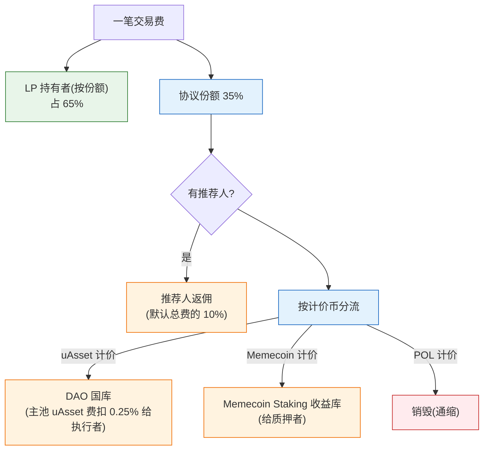

# 商业模式

## 价值主张

Outrun 为两类需求提供一个闭环：

- **生息资产持有者**：想要统一、可流通、跨链的稳定币（uAsset），并希望资产持续增值。
- **Memecoin 社区**：想要一个公平、抗 rug、有持续价值的启动平台，而非纯 PVP 的赌场。

两个需求在 Outrun 里通过 uAsset 对接。OutStake 供给 uAsset，Memeverse 创造 uAsset 的用途与活力。

## 收入来源

Outrun 的收入来自生态内的真实经济活动，不依赖代币增发补贴：

| 收入来源 | 说明 |
|---|---|
| **交易手续费（协议份额）** | Memeverse 每笔交易费的协议部分，含动态费率、开池衰减费、预购结算费 |
| **杠杆创世利息** | 杠杆参与者支付的 uAsset 利息，创世锁定时归协议自留国库 |

此外还有**结算储备金**（非收入）：由流动性部署余额注入，用于覆盖杠杆结算赤字；未消耗部分留存备用，不进国库。

关键特征：**收入和生态活跃度正相关** —— 交易越多、杠杆用得越多，收入越高，与飞轮同向。

## 三个金库别混淆

Outrun 里有三个不同的资金池，受益人各异，别混为一谈：

| 金库 | 资金来源 | 受益人 / 控制人 |
|---|---|---|
| **Memecoin Staking 收益库** | Memecoin 计价的交易手续费 | Memecoin 质押者（份额升值） |
| **DAO 国库** | uAsset 计价的交易手续费 | 社区（提案投票决定怎么花） |
| **协议自留国库** | 杠杆创世的 uAsset 利息 | 协议方自留（非社区共治） |

**注意**：杠杆创世的利息进的是**协议自留国库**，不进 Memeverse 社区的 DAO 国库 —— 两者是不同的池、不同的控制人。这些收益都在 Memeverse 内部分配，**不会回流给 OutStake 的质押者**（OutStake 参与者赚的是底层生息资产增值，详见[增长飞轮](flywheel.md)）。

## 一笔钱流向谁（核心）

这是理解 Outrun 经济模型的关键。一笔 Memecoin 交易费，沿**两个正交维度**分流：

**维度一：LP 与协议的分账**（按费率比例）
- LP 拿 65%，协议拿 35%。
- 若有推荐人，从协议那 35% 里切出返佣给推荐人（默认相当于总费的 10%），协议国库实留约 25%。

**维度二：按计价币分流**（协议那份的去向，取决于这笔费是以哪种币计价的）
- **uAsset 计价** → DAO 国库（其中主池 uAsset 费扣 0.25% 给触发分发的执行者，作为 keeper 式激励）
- **Memecoin 计价** → Memecoin Staking 收益库（给质押者）
- **POL 计价** → 直接销毁（通缩）

两个维度叠加，就是一笔费的完整去向：

补充：
- 辅助池（POL/uAsset、PT/uAsset、PT/POL）的协议费，在锁定阶段还会分一部分给**普通创世参与者**（按份额），其余进 DAO 国库。

## 收入去哪

- **反哺 Memeverse 内部参与者**：质押者收益（Memecoin 费）、普通创世者分成（辅助池费）、DAO 周期激励（uAsset 费）、推荐返佣 —— 让生态对参与者持续有吸引力。
- **留存协议**：国库储备、持续开发、风险缓冲。

「收入大部分反哺生态内参与者」的设计，是 Memeverse 内部飞轮能自我强化的经济基础。

## 关键资源

- **uAsset 流动性**：整个生态的基石，流动性越深，所有功能越好用。
- **多协议适配器**：OutStake 接入的生息资产种类，决定 uAsset 的供给广度。
- **Memecoin 社区**：Memeverse 的活跃度，决定 uAsset 的消耗与收益产出。
- **机制安全性**：动态费率、锁定、结算储备等护栏，是信任的基础。

## 客户与参与者

按风险偏好分三档：**稳健型**（OutStake 质押铸 uAsset + 普通创世；成功解锁后在 24 小时保护期内完整退出，本金 uAsset 守恒）→ **平衡型**（杠杆创世 + 预购，仅利息成本）→ **共建型**（买入并质押 Memecoin、参与 DAO 治理，深度共建）。另有发起人、LP、执行者等专门角色。详见[参与方式与风险偏好](playbooks.md)。

## 可持续性

传统 DeFi 常靠代币增发补贴吸引流动性，不可持续。Outrun 的收入来自**真实交易与杠杆活动**，并把收入反哺给生态参与者，形成正向循环。只要生态在运转，收入就持续；生态越繁荣，收入越多 —— 商业模式和增长飞轮同向。
