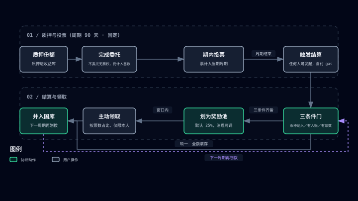

# Memecoin DAO governance

> When "community consensus" becomes crypto's new productive force.

## The Memecoin paradox

A Memecoin is a contradiction: a celebration of grassroots culture and, at the same time, a testing ground for financial bubbles. The average new Memecoin survives for less than two months, and market-cap drawdowns of 80% or more are routine. Beneath the boom sit three structural cracks:

- **Hollow value**: the vast majority of Memecoins run on narrative alone, with no application behind them. Holding one is a game of musical chairs, and the token itself is reduced to a purely speculative symbol.
- **Governance vacuum**: the launcher either concentrates power in a few hands or walks away entirely; the community has neither decision-making rights nor a share of the revenue. One rug pull, and the ecosystem's value goes to zero in an instant.
- **A fractured community**: retail holders, whales, and developers have sharply conflicting interests. Whales dump, panic spreads, and retail has no way to fight back, in a vicious cycle of "the whales feast while retail picks up the scraps."

What Memecoin has been missing is a governance structure that captures trading fees and settles them into community-owned assets.

## How DAO governance plugs into Memecoin

The DAO is not a new idea, but participation in traditional DAOs tends to be dismal: many holders watch nothing but the price, neither knowing nor caring about community affairs.

Memecoin is the opposite: the most community-driven, most emotionally charged ecosystem in crypto, with the most active base of users. Who trades Memecoins without joining the community behind them?

- **Culture and consensus first**: the success of DOGE and SHIB shows that a Memecoin's core value comes from community consensus, not a technical whitepaper.
- **Decentralized by nature**: most have no VCs and no premine, a natural fit with the egalitarian spirit of DAOs.
- **High-liquidity governance**: holders are widely distributed, so votes reflect the community's will quickly, avoiding the decision-making paralysis of traditional DAOs.

Memeverse gives every Memecoin an **on-chain DAO** of its own.

## Governance belongs to long-term holders

Using the Memecoin directly as the governance token would be the simplest design, but what sustains a project is the people who stay with the community for the long haul, not short-term speculators. Voting power should belong to those willing to stand with the community through its ups and downs.

Here is how it works: stake your Memecoin into the YieldVault, and once you hold shares, **delegate** your voting power to yourself (or to a community representative). Only then do the shares carry actual votes. Only people who stake, hold for the long term, and complete delegation have a say in governance. Speculators can still trade, but if they want to steer where the community goes, they first have to come in, stake, and bind themselves to the community. Governance lands in the hands of builders, not passersby.

## Speculators are builders too

Voting rights alone are not enough; people also need a reason to take part. People follow incentives, and most want immediate returns, not speeches about long-termism.

Memeverse's answer is to **let yield drive governance participation**: the more active Memecoin trading is, the more fees flow into the YieldVault and the DAO treasury.

- **Stakers earn yield**: trading fees denominated in Memecoin flow into the YieldVault, and shares keep appreciating as yield accrues (in the early phase, most incoming yield is first absorbed by the vault's buffer and does not show up in the share value right away; see [Memecoin Staking](memecoin-staking.md)).
- **The treasury takes in revenue**: trading fees denominated in uAsset flow into the DAO treasury, giving the community real resources to build with.

The result: **the speculator's trading fees become recurring income for stakers and the community treasury**. Speculation is no longer a purely zero-sum game. Speculators are builders, too.

## Epoch rewards: voting pays

To turn governance from a burden into an activity that pays, the DAO distributes governance rewards by **epoch (90 days, fixed)**. Voting during the epoch is the qualifying condition, and rewards are split by each voter's share of the votes cast, so the more actively you vote, the larger your share. Rewards do not arrive automatically, though; they require a settlement and claim process:

- **Triggering settlement**: after an epoch ends, someone must trigger settlement, which sets aside part of the epoch's treasury income as the reward pool (25% by default; the ratio can be adjusted by governance).
- **Settlement conditions**: votes were cast during the epoch, the treasury took in revenue, and the token is enrolled in the reward program. All three must hold before anything is allocated; an epoch with no votes pays no rewards.
- **Active claim**: after settlement, voters must claim their share within the claim window, calculated from their share of the votes cast that epoch.
- **Missed deadline**: rewards left unclaimed after the window closes roll into the treasury for later epochs and are not reissued.

Voting, triggering settlement, and claiming rewards are all on-chain operations; your wallet needs the native token of the chain in question to pay network fees (gas).

This raises community activity and decision quality at the same time: you get paid only when you vote with care and claim on time.

## The treasury: the community's money, the community's call

Every Memecoin DAO has its own treasury, funded by the uAsset-denominated fees from that Memecoin's trading. How the treasury is spent is **decided by governance**:

- Governance-initiated treasury payouts must be approved by proposal vote and then execute automatically on-chain, where no one can tamper with them. Epoch rewards are distributed automatically at the ratio governance has preset, with no per-payment proposal.
- Each single payout has a **percentage cap**, so no one proposal can move too much of the treasury, and the cap cannot be bypassed through pre-authorization or similar means.
- Some proposals target the DAO governance contract itself or its reward contract, typically a treasury withdrawal, a governance-contract upgrade, or a change to the reward ratio. These must not only pass but pass with a **supermajority**: for votes must reach a high share of the votes cast, a higher bar than an ordinary proposal. That higher bar protects the community from rushed changes.
- After deployment, a DAO has a **startup period** during which no proposals can be created. This gives the community time to organize, stake, complete delegation, and build up voting power, so a small group cannot seize control from day one.

The community can spend the treasury on public goods, hackathons, meme marketing, or investments in ecosystem projects; how it is spent is decided by community vote.

## Three transitions

Memecoin DAO governance exists to prove that a decentralized community can create and distribute value more efficiently, and more fairly, than a company. It brings three transitions:

1. **From Pump & Dump to Build & Earn**: trading fees keep flowing to stakers and the treasury, and governance participants claim epoch rewards.
2. **From financial asset to social contract**: a Memecoin DAO is a rights-distribution agreement enforced by code, turning holders into "citizens of the protocol."
3. **From one-off issuance to ongoing governance**: after the unlock, the community still votes on how funds are used and where the project goes.

## Example

> A Memecoin launches and trades actively, and uAsset-denominated fees keep flowing into its DAO treasury. Once community members have staked the Memecoin and completed delegation, someone proposes using the UUSD in the treasury for a community airdrop and liquidity incentives. A proposal of this kind, drawing on the treasury, must reach quorum and win a **supermajority** to pass; the transfer then executes automatically on-chain. Members who voted claim their epoch rewards after settlement. A proposal to upgrade the DAO contract or adjust the reward ratio likewise requires a supermajority. Proposals aimed at third-party contracts, such as community partners, pass with a simple majority.

## What the community actually gets

Memecoin DAO governance is not a slogan. It turns the community into an **entity that runs itself**:

- It has a **treasury**: the more active the trading, the fuller the treasury grows, and the money belongs to the community, not to any launcher.
- It has **rules of order**: proposals, voting, quorum, spending caps, and supermajorities for major matters are all written on-chain, where no one can tamper with them.
- It has **recurring income**: stakers earn fees, and governance participants claim epoch rewards.
- It has **the capacity to evolve**: the treasury can fund new applications, hackathons, marketing, and ecosystem investments, and the community decides where to go next.

A Memecoin holder who keeps earning a share of trading activity and can vote on how the treasury is spent and what the community builds is no longer a gambler at the table waiting for a pump. They are a community member with income, a voice, and a future. And the community is no longer a chat group that only knows how to shill: it is an organization with funds, rules, and the capacity to keep getting things done.

The goal of Memeverse DAO governance is concrete: a treasury with fees arriving continuously, every payout decided by vote, a community that holds both the funds and the votes.

## DAO parameters at a glance

| Parameter | Meaning |
|---|---|
| Epoch | 90 days, fixed; rewards settle once per epoch (an epoch is not a voting period) |
| Reward allocation | 25% of the epoch's treasury income is set aside as the reward pool after settlement (default; adjustable by governance). Rewards must be claimed actively; unclaimed amounts roll back into the treasury after the window |
| Voting power | Staked shares generate voting power once delegation is complete (standard token voting) |
| Voting delay and voting period | After a proposal is created, a delay passes before voting opens; voting then stays open for a fixed length of time |
| Quorum | A vote is valid only if minimum participation is reached |
| Treasury spending cap | A single proposal can move only a capped percentage of treasury funds, preventing a one-shot drain |
| Supermajority matters | Proposals targeting the DAO governance contract or the reward contract, such as treasury withdrawals, governance-contract upgrades, or reward-ratio changes, require a supermajority (a higher bar than ordinary proposals) |
| Startup period | After the DAO is deployed, proposals are disabled for a period, giving the community time to organize |

> Note: undelegated shares carry no votes but still count toward the voting base, raising the number of votes a proposal needs to reach quorum.
> Exact values follow each Memecoin's deployment configuration.
