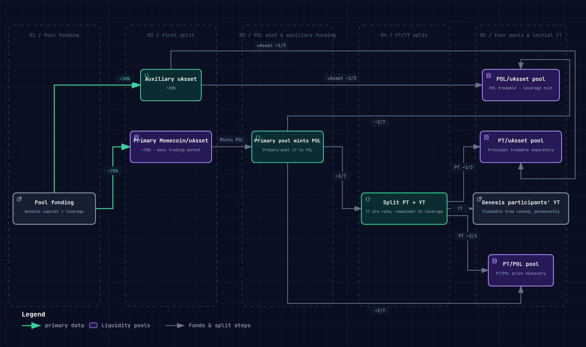

# Four-pool liquidity

## Why not a single pool

An ordinary Memecoin launch usually runs on a single thin pool, where the price is easy to manipulate and front-run. When Genesis reaches its target, Memeverse instead creates **four liquidity pools** at once. Each pool has its own function, and together they form a liquidity structure with depth, price discovery, and the ability to separate principal from yield.

## The four pools

| Pool | Pair | Role |
|---|---|---|
| **Primary pool** | Memecoin / uAsset | The main trading market; carries almost all of the trading depth |
| **POL/uAsset pool** | POL / uAsset | Lets POL (the liquidity receipt) trade directly, and gives leverage settlement an exit |
| **PT/uAsset pool** | PT / uAsset | Lets the Principal Token trade on its own |
| **PT/POL pool** | PT / POL | Price discovery between principal and the liquidity receipt |

**POL** is the receipt for the locked liquidity; PT and YT are the principal and yield that come from splitting POL (see [POL split](pol-splitter.md) for details).

## How the capital is split

The uAsset raised in Genesis follows two flows: one part goes into the pools directly, and the other part is used by the primary pool to produce POL and PT.

- **uAsset flow**: about 70% of the uAsset enters the primary pool (Memecoin/uAsset), ensuring the main trading market has sufficient depth; the remaining 30% or so serves as the uAsset capital of the auxiliary pools and enters the POL/uAsset and PT/uAsset pools.
- **POL flow**: the primary pool mints POL (the liquidity receipt) against its own ~70% of the capital. The POL is split roughly 2:3:2. Of that, 2 parts go into the POL/uAsset pool, 3 parts are split into PT+YT (the YT is distributed to Genesis participants), and 2 parts go into the PT/POL pool. The PT that comes out of that split is then divided roughly 1:2. One part enters the PT/uAsset pool and two parts enter the PT/POL pool.

These ratios are the target allocation at Genesis completion. The actual amounts entering each pool are determined by market prices at deployment time and may differ slightly. The small remainder of POL/PT that does not enter a pool is claimed pro rata after unlock. uAsset left over after the pools are built goes into the settlement reserve (once the reserve is full, the excess goes to the treasury), and leftover Memecoin is burned outright.

This structure keeps the primary pool deep while giving POL and PT each a tradable secondary market. During the lock-up period, YT can be bought and sold against POL through **YT Flash Swap**, which reuses the PT/POL pool instead of running a separate trading pool (see [YT Flash Swap](yt-flash-swap.md) for details). After unlock settlement, the settlement residual value is redeemed pro rata.

For a standard Genesis participant, the uAsset held in the auxiliary pools, the primary-pool uAsset behind their PT, and the primary-pool uAsset behind their POL together cover the principal they committed. The full principal-conservation relationship and the exit steps at unlock are described in [standard Genesis](genesis.md).

## Where auxiliary-pool fees go

One key design decision is where the fees generated by the auxiliary pools (POL/uAsset, PT/uAsset, PT/POL) end up:

- **Fees denominated in POL**: **burned** outright (deflationary).
- **Fees denominated in uAsset or PT**: during the Locked phase, these are split according to the share of leverage debt: part goes to **standard Genesis participants** (pro rata by Genesis share) and part to the **DAO treasury**. Whatever accrues after unlock goes to the DAO treasury.

Beyond receiving YT, standard Genesis participants can also **keep claiming a share of the auxiliary-pool fees**, an extra return on taking part in Genesis that often goes unnoticed.

## What this design delivers

- **Manipulation-resistant depth**: the primary pool holds a large amount of capital, so no single large trade can move the price sharply.
- **Fair price discovery**: separate pools for POL and PT give principal and yield their own market prices.
- **An exit for leverage settlement**: the POL/uAsset and PT/uAsset pools give leveraged Genesis a channel to recover funds at the unified settlement.
- **Principal and yield separated**: users can hold or trade only the principal (PT), or pursue only the yield (YT).
- **Extra returns for Genesis participants**: the auxiliary-pool fee share gives early participants an ongoing cash flow.

## Example

> A Memecoin Genesis raises 1,000,000 UUSD. About 700,000 of that uAsset goes into the primary pool (Memecoin/uAsset) to establish the main trading depth; the remaining 300,000 or so of uAsset serves as auxiliary-pool capital and enters the POL/uAsset and PT/uAsset pools. The primary pool mints POL against its own liquidity, split roughly 2:3:2. Of that, 2 parts go into the POL/uAsset pool, 3 parts into PT+YT, and 2 parts into the PT/POL pool. The PT from that split is then divided roughly 1:2 between the PT/uAsset pool and the PT/POL pool. The primary pool ends up deep, and POL and PT each have a tradable market. YT can be traded via Flash Swap during the lock-up and paid out pro rata after settlement. Standard Genesis participants keep collecting a share of the fees the auxiliary pools generate.

The four pools are the core design that sets Memeverse apart from single-pool launch platforms, and the foundation that dynamic fees, leverage settlement, and PT/YT trading run on.
