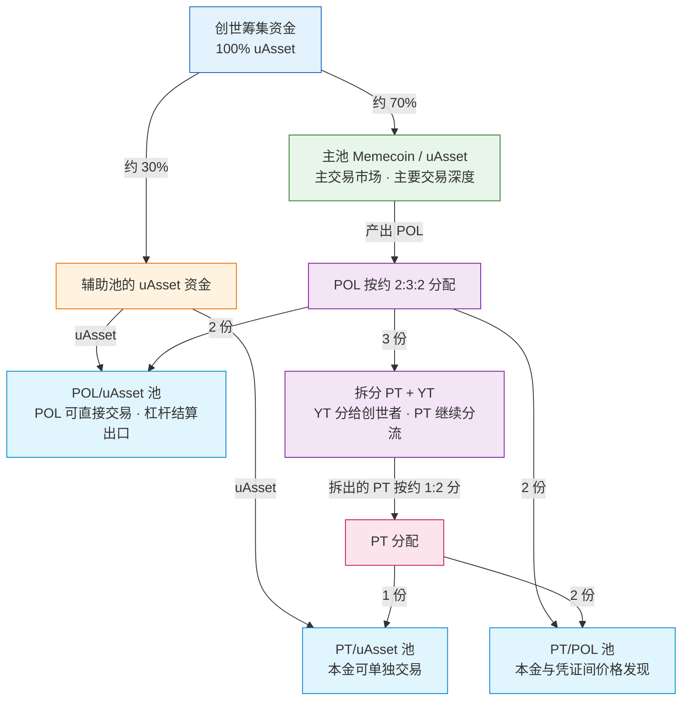

# 四池流动性

## 为什么不是一个池子

普通 Memecoin 启动往往只有一个稀薄池子，价格极易被操纵、被抢跑。Memeverse 在创世达标时一次性建立**四个流动性池**，各自承担不同职能，共同构成一个有深度、有价格发现、能拆分本金与收益的流动性结构。

## 四个池子

| 池子 | 交易对 | 作用 |
|---|---|---|
| **主池** | Memecoin / uAsset | 主交易市场，承载绝大部分交易深度 |
| **POL/uAsset 池** | POL / uAsset | 让 POL（流动性凭证）可直接交易，为杠杆结算提供出口 |
| **PT/uAsset 池** | PT / uAsset | 让本金代币可单独交易 |
| **PT/POL 池** | PT / POL | 本金与流动性凭证之间的价格发现 |

其中 **POL** 是锁定流动性的凭证；**PT / YT** 是把 POL 拆分出的本金与收益（详见 [POL 拆分](pol-splitter.md)）。

## 资金怎么分

创世筹集到的 uAsset 分两路：一部分直接进池，另一部分由主池再产出 POL 与 PT。

- **uAsset 流**：约 70% 的 uAsset 进主池（Memecoin/uAsset），确保主交易市场有足够深度；其余约 30% 作为辅助池的 uAsset 资金，进入 POL/uAsset 与 PT/uAsset 池。
- **POL 流**：主池据此铸出 POL（流动性凭证），POL 按约 2:3:2 分——2 份进 POL/uAsset 池、3 份拆成 PT+YT（YT 分给创世者）、2 份进 PT/POL 池；拆出的 PT 再按约 1:2 分——1 份进 PT/uAsset 池、2 份进 PT/POL 池。

以上比例为创世达成时的目标配置，实际进入各池的数量以部署时的市场价为准，可能略有出入；未进入池子的少量剩余 POL/PT 在解锁后按份额领取。

这种结构让主池保持深度，同时为 POL、PT 各自建立可交易的二级市场；YT 在锁定期内可通过 **YT Flash Swap** 用 POL 买卖（复用 PT/POL 池，不设独立交易池，详见 [YT 闪电兑换](yt-flash-swap.md)），解锁结算后按份额赎回结算残值。

对普通创世者而言，辅助池中的 uAsset、PT 对应的主池 uAsset、POL 对应的主池 uAsset 共同覆盖其投入本金。完整的守恒关系与解锁退出步骤见 [普通创世 Genesis](genesis.md)。

## 辅助池手续费的归属

辅助池(POL/uAsset、PT/uAsset、PT/POL)产生的手续费，去向有个关键设计：

- **POL 计价的手续费**：直接**销毁**（通缩）。
- **uAsset / PT 计价的手续费**：在锁定阶段，按杠杆债务占比切分 —— 一部分给**普通创世参与者**（按创世份额分成），一部分进 **DAO 国库**；解锁后新产生的部分归 DAO 国库。

也就是说，普通创世者除了拿 YT，还能**持续领取辅助池的手续费分成** —— 这是参与创世的一项额外收益，常常被忽略。

## 这样设计带来什么

- **深度抗操纵**：主池有大量资金，单笔大额交易难以剧烈拉动价格。
- **公平价格发现**：POL 与 PT 的独立池子，让本金和收益各自有市场定价。
- **杠杆结算出口**：POL/uAsset、PT/uAsset 池为杠杆创世到期结算提供了回收资金的通道。
- **本金与收益分离**：用户可只持有或交易本金(PT)，也可只追求收益(YT)。
- **创世者额外收益**：辅助池手续费分成让早期参与者获得持续现金流。

## 举例

> 某 Memecoin 创世筹集到 100 万 UUSD。其中约 70 万 uAsset 进主池（Memecoin/uAsset），建立主交易深度；其余约 30 万 uAsset 作为辅助池资金，进入 POL/uAsset 与 PT/uAsset 池。主池据此铸出 POL，POL 按约 2:3:2 分：2 份进 POL/uAsset 池，3 份拆成 PT+YT，2 份进 PT/POL 池；拆出的 PT 再按约 1:2 分，分别进 PT/uAsset 池和 PT/POL 池。这样主池有深度，POL、PT 各有可交易的市场，YT 在锁定期可经 Flash Swap 交易、结算后按份额兑付；普通创世者还能持续领取辅助池产生的手续费分成。

四池是 Memeverse 区别于单一池子启动平台的核心设计，也是后续动态费率、杠杆结算、PT/YT 交易能够运转的基础。
