# 普通创世 Genesis

普通创世是 Memeverse 的基础参与方式：用户投入 uAsset，为一个新 Memecoin 建立初始流动性，并获得 YT、辅助池手续费和解锁后的流动性权益。用户可以在产品模型内，用守恒的 uAsset 本金博取额外的 Memecoin 上行。

## 怎么参与

在创世阶段，用户投入 uAsset 参与普通创世：

- 参与前需持有对应链上的 uAsset，并在操作时确认扣取授权。
- 创世只在特定阶段开放：创世期间可投入，进入锁定阶段后不再接受新的普通创世投入。
- 若创世未达标、协议不建池，投入的 uAsset 会全额退款（见下）。

## 参与后获得什么

创世成功进入 Locked 后，普通创世者按投入份额获得：

- **YT**：解锁结算后分得剩余 uAsset 和 Memecoin。
- **辅助池手续费**：Locked 阶段由 POL/uAsset、PT/uAsset、PT/POL 池产生的普通侧手续费分成。
- **辅助池 LP**：Unlocked 后领取 POL/uAsset、PT/uAsset、PT/POL 三个池的流动性份额。
- **剩余 POL/PT**：四池部署时未进入 LP 的普通侧剩余资产。

普通创世者不是直接领取一张“本金凭证”，而是通过上述组合权益覆盖投入的 uAsset。POL、PT、YT 的具体作用见 [POL 拆分](pol-splitter.md)，四池结构见 [四池流动性](four-pools.md)。

## 为什么普通创世无风险

普通创世的无风险来自**资金守恒 + 解锁保护**，不是 Memecoin 价格不会下跌。

创世投入的 uAsset 100% 用于四池：约 70% 进入 Memecoin/uAsset 主池，约 30% 进入辅助池路径。解锁结算后，普通侧本金由三部分共同覆盖：

| 本金来源 | 对应普通侧投入 |
|---|---:|
| 辅助池中的 uAsset | 约 30% |
| PT 对应的主池 uAsset | 约 30% |
| POL 对应的主池 uAsset | 约 40% |
| **合计** | **100%** |

因此，Memecoin 是普通创世本金之外新铸造的上行权益：上涨时，YT、Memecoin 和手续费带来额外收益；归零时，普通侧仍可在保护期内通过辅助池 LP、PT 和 POL 按份额恢复 uAsset 本金。

若创世未达标，协议不建池，普通创世投入的 uAsset 全额退款。

## 24 小时流动性保护

锁定期结束不等于立刻恢复自由交易。Verse 实际进入 Unlocked、统一结算成功后，协议开启 **24 小时流动性保护期**：

- Memecoin/uAsset、POL/uAsset、PT/uAsset、PT/POL 四个池暂停公开交易。
- 普通创世者领取辅助池 LP、剩余 POL/PT 和费用权益不受影响。
- PT、YT、POL 的结算与赎回不受影响。
- 移除辅助池和主池流动性不受影响。

没有公开交易改变池内价格时，所有退出都按静态池储备和创世份额执行。用户退出的先后顺序不会改变其他普通创世者按份额对应的本金。

保护期从 Verse **实际进入 Unlocked 的交易时间**开始计算，不从计划解锁时间提前计算。

## 如何完整退出

普通创世的“本金无风险”以在保护期内完成组合权益退出为前提。完整流程是：

1. **领取权益**：领取 YT、三个辅助池 LP、剩余 POL/PT 和尚未领取的普通侧手续费。
2. **移除辅助池流动性**：将 POL/uAsset、PT/uAsset、PT/POL LP 拆成底层 uAsset、POL 和 PT。
3. **赎回 PT**：按结算锚定比率换回 uAsset。
4. **赎回 POL**：烧毁 POL，取回对应的主池 uAsset 和 Memecoin。当场拆解时需设定最低到账数量与截止时间作为滑点保护，未设定操作会被拒绝。
5. **赎回 YT**：领取结算后的剩余 uAsset 和 Memecoin。
6. **确认完成**：在 24 小时保护期结束前完成上述本金权益的领取与拆解。

各步骤可以分笔执行；关键是不要把“领取到 LP、POL、PT 或 YT”误认为已经完成 uAsset 本金退出。

## 无风险的边界

本文中的“普通创世无风险”专指以下产品模型：

- 创世成功，Verse 已完成统一结算并进入 Unlocked。
- 用户在随后 24 小时流动性保护期内完成普通创世组合权益的完整退出。
- 讨论的是 Memeverse 机制内的 uAsset 本金，不包含 uAsset 底层资产、第三方协议、跨链、合约、网络、暂停和用户操作风险。

保护期结束后，四池恢复公开交易，池内资产组成会随市场变化。用户继续持有 LP、POL、PT、YT 或 Memecoin，或在期后再退出，由此产生的价格和流动性结果由用户自行承担。

## 一句话理解

> 普通创世让 uAsset 本金在四池组合中守恒，并用新铸造的 Memecoin、YT 和手续费提供额外上行；成功解锁后，在 24 小时流动性保护期内完成完整退出，即可按份额恢复 uAsset 本金。
