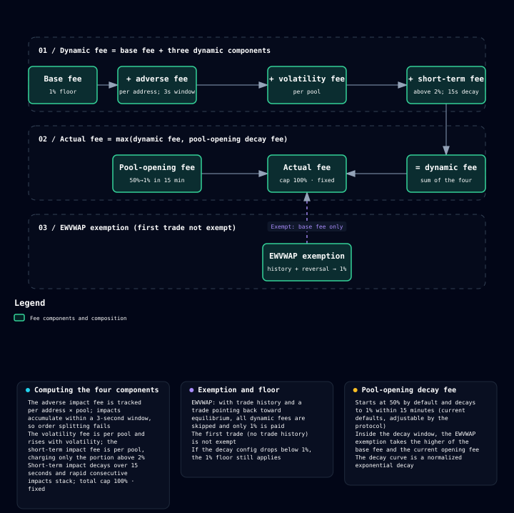

# 动态费率 Hook

## 基于 Uniswap V4

Memeverse 不自研交易引擎，而是基于 **Uniswap V4 的 Hook 机制**搭建交易层。Hook 允许在每笔交易前后插入自定义逻辑 —— Memeverse 用它实现动态费率、预购结算和短期冲击计费，流动性本身享受 Uniswap V4 的成熟与安全。

## 动态费率的组成

普通 AMM 用固定费率，容易被套利者和高频策略钻空子。Memeverse 的费率是**动态**的，由基础费率加三部分动态组件组成：

- **基础费率**：1% 的底价。
- **逆向冲击费（按地址）**：交易推动价格偏离均衡时，按冲击大小计费；同一地址在 3 秒窗口内的连续冲击会累积合并计费。这让拆单攻击（把大单拆成小单躲避费率）无法规避冲击成本——拆出的每一单都计入同一窗口的累积冲击。
- **波动费（按池）**：近期价格波动越剧烈，费率越高，抑制过度投机。
- **短期冲击费（按池）**：每笔交易按价格冲击计费，冲击不超过 2% 的部分免征（只对超过 2% 的部分计费）；冲击量在 15 秒内衰减，快速连续冲击会叠加。

费率有硬上限 100% · 固定，不会无限飙升。

## 什么情况加费，什么情况减免

动态费是否生效、加多少，由以下条件决定：

| 交易情况 | 费率 |
|---|---|
| 首笔交易（池内尚无成交历史） | 全额动态费 |
| 交易推动价格偏离均衡（EWVWAP） | 全额动态费 |
| 交易让价格回归均衡，且池内已有成交历史 | 豁免动态费，只付基础费率 |
| 同一地址 3 秒窗口内的累积冲击 | 逆向冲击费累积计入 |
| 池内价格波动上升 | 波动费上升 |
| 单笔价格冲击超过 2% | 对超出部分计短期冲击费（15 秒内快速连续冲击叠加） |

## EWVWAP 豁免：方向对了才减免

动态费率对普通用户不一定友好，但存在一个关键减免：**当池内已有成交历史，且一笔交易让价格比交易前更接近均衡（EWVWAP）时，跳过全部动态费，只收基础费率。**

这意味着：

- 让价格回归均衡的交易（包括顺势买入、提供流动性），只付基础费率（开池高费率衰减窗内，取基础费率与当前开池费的较高者）。
- 推动价格偏离均衡、制造波动的交易，按上述条件承担动态费。

注意：没有成交历史的首笔交易，以及推动价格偏离的单笔交易，都不在豁免范围内。

## 开池初期高费率防抢跑

新池刚开时最脆弱 —— 抢跑者会抢在第一笔交易前插队。Memeverse 在开池瞬间设一个**很高的初始费率**，然后随时间指数衰减到基础费率。**默认初始费率为 50%、15 分钟内衰减到 1%，二者都是 owner 可调整的默认值。**费率随时间衰减，进入越晚费率越低。

以默认配置为例，开池后的费率衰减大致如下（按归一化指数曲线衰减）：

| 开池后时间 | 开池费率 |
|---|---|
| 0 分钟 | 50% |
| 1 分钟 | 约 38% |
| 5 分钟 | 约 13% |
| 10 分钟 | 约 3.6% |
| 15 分钟 | 1% |

两端数值（初始 50%、终值 1%）为当前默认，协议方可调；中间数值随实际参数按比例变化。

## 费率怎么分

每笔交易费按固定比例分配：

| 场景 | LP | 协议国库 | 推荐返佣 |
|---|---|---|---|
| 无推荐人 | 65% | 35% | 0 |
| 有推荐人（默认） | 65% | 25% | 10% |

推荐返佣来自协议费份额，奖励带来新用户的推荐人，鼓励社区传播。

## 谁可以发起交易

Memeverse 的公开交易都由**智能账户**发起。普通钱包（未部署合约代码的账户）无法直接完成交易 —— 需使用 Safe 等智能账户钱包。整笔交易在同一笔原子交易内「开启会话 → 执行交易 → 关闭会话」完成，会话由前端自动包裹、对用户不可见；没有活动会话、或会话发起者与交易发起者不是同一钱包时，交易直接回滚，不会产生资金损失。

这一要求与 [YT 闪电兑换](yt-flash-swap.md) 一致，是 Memeverse 交易层的统一规则。

## 预购专用结算通道

预购（Preorder）不走公开交易路径，而是通过 Hook 内一条**专用的固定 1% 费率结算通道**（详见 [预购](preorder.md)），跳过动态费率和开池高费率机制。全部预购资金聚合为主池建立后的第一笔 AMM 交易，所得 Memecoin 按预购资金占比分配。所有预购者共享该笔交易的平均成交成本；固定的是结算费率，不是 Memecoin 单价。这笔结算会改变主池储备和后续公开交易的起始价格。

## 举例

> 某 Memecoin 刚开池，初始费率 50%，15 分钟内衰减到 1%。开池后的首笔交易没有成交历史，按全额动态费计费；此后一只夹击者想快速夹击一笔大单，它的交易推动价格偏离均衡、单笔冲击超过 2%，逆向冲击费与短期冲击费叠加计费。相反，一笔方向是让价格回归均衡的顺势交易，只要池内已有成交历史，就触发 EWVWAP 豁免，只付基础费率（开池衰减窗内取当前开池费的较高者）。

## 定价维度与边界

动态费率 Hook 通过「方向、时间窗口、波动」三个维度给交易定价：方向回归均衡的交易有机会只付基础费率，推动偏离或制造冲击的交易承担更高成本。Memeverse 的交易层因此兼顾市场深度与抗操纵——但动态费率是**缓解手段而非绝对保证**，实际费率和保护效果随池内状态与 owner 配置参数而变化。
