# 启动生命周期

一个 Memecoin 从启动到流通，经历几个清晰阶段。每个阶段该做什么、谁能做什么，下面按顺序讲。

## 阶段一览



### 阶段 × 开放操作

| 操作 | 开放阶段 |
|---|---|
| 参与创世（普通／杠杆）、预购 | 仅创世期 |
| 退款领取（每地址一次） | 仅退款态 |
| 领 YT（普通／杠杆）、辅助池手续费分成、LP 领取已累积手续费、加池铸 POL、预购领取（线性）、触发费分发、质押 Memecoin | 锁定期起 |
| YT 拆分／合并 | 仅锁定期 |
| 公开交易 | 锁定期起（解锁时的 24 小时保护窗内暂停） |
| 烧 POL 赎回、一次性领辅助池 LP＋剩余、PT 赎 uAsset、YT 领残值 | 解锁期起 |

## 1. 创世（Genesis）

发起人设定规则（选哪些链、初始定价、最低筹集额度），创世开启。

- 参与者存入 uAsset 参与**普通创世**（基础参与方式）。
- 看好的人可用 uAsset 或创世积分**加杠杆**，在普通创世基础上放大份额（付利息）。
- 也可通过**预购（Preorder）**提前锁定 Memecoin —— 预购是独立结算通道，可与普通/杠杆创世叠加。
- 普通创世资金、杠杆利息和预购资金分别记账，不合并计算成功门槛。

这一步聚集共识：谁先参与、参与多少，决定 Memecoin 起步体量。

### 创世如何达标

满足以下任一条件，创世即达到成功门槛：

```text
普通创世资金 >= 最低成功额度
或
杠杆利息 >= 最低成功额度
```

两个门槛独立判断，金额不相加。预购资金和由杠杆利息推导出的杠杆债务本金都不计入成功门槛。

三类金额分别用于不同环节：

| 口径 | 计算方式 | 用途 |
|---|---|---|
| 成功判定 | 普通创世资金或杠杆利息任一独立达到最低成功额度 | 决定进入 Locked 还是 Refund |
| 建池资金 | 普通创世资金 + 杠杆债务本金 | 创世成功后建立四池流动性 |
| 预购资金 | 单独记录 | 主池建立后聚合买入 Memecoin，不参与成功判定或四池初始建池 |

阶段推进需要一笔链上交易触发，不会随时间自动发生：

- 开启**快速创世**时，任一成功门槛达标后即可在截止前触发，提前进入 Locked。
- 未开启快速创世时，即使提前达标，也要等创世截止后再触发。
- 截止后触发时，任一门槛达标则进入 Locked；两个门槛均未达标则进入 Refund。

## 2. 锁定（Locked）—— 创世达标

普通创世资金或杠杆利息任一独立达到最低成功额度，并完成阶段推进后，创世成功进入锁定阶段：

- 协议部署**四池流动性**，Memecoin 与 uAsset 配对，正式建交易市场。
- 流动性被锁定 **365 天**（合约硬约束），锁定期内任何一方都无法抽走资金，经典的「抽走流动性」rug 路径被阻断。
- Memecoin 可在受保护的市场交易（详见[动态费率 Hook](hook.md)）。

**锁定后，各类参与者可以领取和操作：**

| 谁 | 能做什么 |
|---|---|
| 普通创世者 | 领取初始 YT（收益权）、领取辅助池手续费分成 |
| 杠杆创世者 | 领取杠杆 YT |
| 任何人 | 用 uAsset + Memecoin 加池，铸造 POL 成为 LP，赚手续费 |
| Memecoin 持有者 | 把 Memecoin 质押进收益库，赚手续费收益 |
| LP | 领取已累积的 LP 手续费 |
| 预购者 | 按线性解锁，逐步领取 Memecoin |
| 执行者 | 触发手续费分发，获得主池 uAsset 费 0.25%（当前默认）的执行奖励 |

**信任面说明**：上述保证覆盖「锁定期内的流动性」——它阻断的是抽走流动性的 rug 路径。协议方仍保留管理权限：创世参数（最低成功额度、初始定价等）可在创世判定前调整，费率默认值可由协议方配置，协议本身也保留升级能力。这些权限不改变资金被锁定的约束，但属于协议方的管理范围。

## 3. 退款（Refund）—— 创世未达标

创世截止后，如果普通创世资金和杠杆利息均未独立达到最低成功额度，触发阶段推进后进入退款：

- 普通创世者存入的 uAsset 退还给参与记录的受益人。
- 杠杆创世付的利息一并退还（uAsset 利息退 uAsset，创世积分退积分）。
- 预购资金也全额退还。
- 没有人损失本金。
- 由他人代付参与时，退款同样退给参与记录的受益人，而不是付款方账户。

参与创世**没有筹资失败的风险** —— 达标才推进，不达标全额退。

## 4. 解锁（Unlocked）

锁定期满，进入解锁阶段，各类参与者退出与结算：

| 谁 | 能做什么 |
|---|---|
| POL 持有者 | 烧 POL 赎回主池流动性（Memecoin + uAsset） |
| 普通创世者 | 一次性领取辅助池 LP 份额 + 剩余分配 |
| PT 持有者（辅助池 LP） | 按 PT 赎回 uAsset（PT 主要在辅助池作 LP，非普通创世者本金凭证） |
| YT 持有者 | 按 YT 分得结算后的剩余收益（uAsset + Memecoin） |
| 杠杆参与者 | 按付息比例领取结算残值 |

Verse 实际进入 Unlocked、统一结算成功后，会开启 **24 小时流动性保护期**。期间四池暂停公开交易，但领取权益、移除流动性和赎回 PT/YT/POL 保持开放，普通创世者可在静态池状态下完成本金退出。赎回 POL 并当场把主池流动性拆成 Memecoin 与 uAsset 时，需设定最低到账数量与截止时间作为滑点保护，未设定操作会被拒绝。窗口结束后四池恢复公开交易，继续持有或期后退出的价格与流动性结果由用户自行承担。详见 [普通创世 Genesis](genesis.md)。

此后 Memecoin 进入常态运行：交易持续产生手续费、质押者持续赚收益、DAO 治理持续运转。

## 举例：一个 Memecoin 的完整一生

> 某 Memecoin 的发起人在 3 条链启动创世，设定最低成功额度为 5 万 UUSD。
> - **三套口径**：普通创世资金为 6 万 UUSD，杠杆利息为 2 万 UUSD，由利息推导的杠杆债务本金为 20 万 UUSD，预购资金为 8 万 UUSD。
> - **成功判定**：普通创世资金 6 万 UUSD 已独立达到门槛，因此创世达标；杠杆利息和预购资金不与它相加。如果开启快速创世，此时即可提前触发；否则在截止后触发。
> - **建池与预购**：四池初始建池资金为 6 万普通创世资金 + 20 万杠杆债务本金，共 26 万 UUSD。8 万预购资金单独用于主池建立后的聚合买入。
> - **锁定**：四池建立，该 Memecoin 上线，LP 在主池加池赚手续费。普通创世者领到 YT 和辅助池费分成；杠杆创世者领到杠杆 YT；持有 Memecoin 的人可质押进收益库赚手续费收益。
> - **解锁**：锁定期满并完成统一结算，普通创世者领取辅助池 LP 份额 + 剩余分配，并在 24 小时流动性保护期内完成本金权益退出；保护期结束后恢复自由交易，质押者继续赚手续费，DAO 治理持续运转。
> - **失败示例**：普通创世资金为 3 万 UUSD，杠杆利息为 3 万 UUSD，预购资金为 20 万 UUSD。虽然三者合计超过 5 万，但两个成功门槛均未独立达标；截止后触发阶段推进，进入 Refund，三类用户按各自账本退款。

整个生命周期由链上规则编排，阶段推进由公开交易触发，状态和资金口径可验证。
