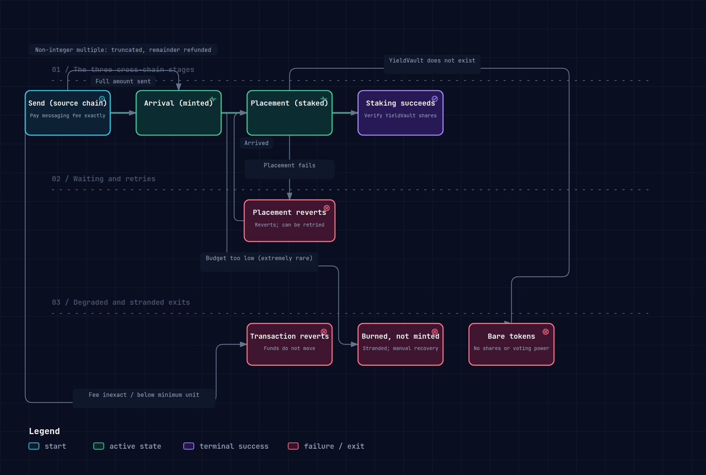

# Omnichain interoperability

## One Memecoin, multi-chain consensus

Memeverse is built on LayerZero, and every Memecoin is itself an **Omnichain Fungible Token (OFT)**. A single Memecoin can launch and circulate on multiple chains at the same time, and its consensus is not locked into any one chain.

## Multi-chain launches

A launcher can choose to **launch the same Memecoin on multiple chains simultaneously**. Users on every chain can join the Genesis using their own chain's uAsset, with no cross-chain detours. Each chain's Genesis, phase progression, and four pools are fully independent: one chain can complete its launch and enter the Locked phase while another falls short of its raise and issues refunds, and neither outcome affects the other.

## The governance chain

When a Memecoin launches, one chain is designated as its **governance chain**: that chain hosts the Memecoin's YieldVault and DAO governance contract (Governor). Staking, yield distribution, and DAO voting for the Memecoin all run through the governance chain. Why consolidate on a single chain? Governance and yield settlement need one authoritative state, and spreading them across chains makes voting power and yield distribution hard to keep consistent. Launchers usually pick the chain with the deepest liquidity and the lowest gas as the governance chain.

## Cross-chain staking

Memecoin can be moved cross-chain to the **governance chain** and staked into the YieldVault there. No matter which chain you originally acquired your Memecoin on, you can bring it to the governance chain to stake, earn yield, and exercise your governance rights. Cross-chain staking does depend on the YieldVault on the governance chain already being in place, and shares should be verified once the transfer arrives; see "Cross-chain reliability" below.

## Cross-chain yield aggregation

A Memecoin may trade on many chains at once. The trading fees earned on each chain are **aggregated cross-chain** into the YieldVault on the governance chain and distributed to all stakers on uniform terms. It does not matter which chain a trade happens on; the yield is collected into one place.

## GenesisCredit is cross-chain too

GenesisCredit is likewise an omnichain token and can be transferred cross-chain (see [GenesisCredit](genesis-credit.md)). Credits must be claimed on the home chain (the chain that issues them) before they can move cross-chain. A destination chain can only receive credits that were transferred to it; it cannot claim the airdrop directly. You can move your credits to another chain and use them in a Memecoin Genesis there.

## Cross-chain reliability

When Memecoin or GenesisCredit moves cross-chain, the protocol requires the sender to **pay the cross-chain messaging fee exactly** (paying too much or too little reverts the transaction). The protocol also attaches replay protection to prevent duplicate arrivals and double accounting.

A cross-chain transfer is not a single action but three stages, and each can succeed or fail on its own; the three must not be conflated:

1. **Send** — executed on the source chain. If the messaging fee is not exact, or the amount is below the cross-chain minimum unit, the transaction reverts immediately and no funds move. If the amount is not an integer multiple of that unit, the truncated portion is sent and the remainder is refunded in the same transaction.
2. **Arrival** — the destination chain mints the Memecoin / GenesisCredit. Once the send succeeds, the message is queued for delivery through the cross-chain channel. If the destination chain is temporarily unable to receive it, the protocol **does not roll back the completed send on the source chain**; the message is redelivered on the destination chain. In rare cases (the destination chain's message-receiving budget is configured too low), funds can end up stranded: burned on the source chain while the mint on the destination chain never happens. No funds are lost, but they sit in a "sent, not yet arrived" state that requires manual recovery.
3. **Placement** — the follow-up action after arrival, such as staking into the YieldVault. If this step fails, it reverts and can be retried. If the destination YieldVault does not exist, the arrived Memecoin is transferred directly to the recipient instead of being staked automatically, and **no staking shares or voting power are created**.

| Stage | Failure case | Result |
| --- | --- | --- |
| Send | Messaging fee inexact / amount below the minimum unit | Transaction reverts immediately; funds do not move |
| Send | Amount not an integer multiple of the minimum unit | Truncated portion is sent; remainder refunded in the same transaction |
| Arrival | Destination chain temporarily unable to receive | Source chain not rolled back; message redelivered on the destination chain |
| Arrival | Destination chain's receiving budget configured too low | Funds stranded (burned on source, not minted on destination); manual recovery required |
| Placement | YieldVault does not exist | Arrived Memecoin transferred directly to the recipient; no staking shares created |

"Sent cross-chain", "arrived on the destination chain", and "staked on the destination chain" are therefore three different things: the previous step succeeding does not mean the next one will.

When would the YieldVault not exist? It is deployed only when the governance chain has completed its Genesis and entered the Locked phase. If you initiate a cross-chain stake before the governance chain reaches that point, the YieldVault is not there, and the cross-chain transfer can only "arrive without staking". The same happens if the Memecoin's Genesis ultimately fails and enters the refund phase. The same degraded outcome occurs when the governance chain's YieldVault is already in place but the source chain's own Genesis has not finished. Cross-chain stakes are initiated without any phase check, and there is no way to know in advance whether the vault on the other side exists.

So after a cross-chain stake arrives, **verify your YieldVault shares**, not just your token balance: only credited shares mean the stake actually took effect and carries yield and voting power. If only bare tokens arrived and no shares were credited, the stake did not take effect; you can initiate it again once the YieldVault is in place. If the Memecoin ultimately fails to launch, there will be no YieldVault and no way to stake at all.

> Note: uAsset (on the OutStake side) carries an additional rate limit on cross-chain transfers to guard against abnormally large outflows; Memecoin / GenesisCredit transfers on the Memeverse side use a different set of security constraints.

## What omnichain brings

Being omnichain-native makes every Memeverse Memecoin a **multi-chain asset** from the moment it is born:

- Reach users on every chain instead of being confined to one chain's community.
- Asset identity, governance, and yield stay unified across chains; each chain's liquidity is pooled independently and remains chain-local.
- Natively compatible with OutStake's omnichain uAsset, so capital moves freely across chains.

This is the most direct expression of Outrun's omnichain positioning in Memeverse.
