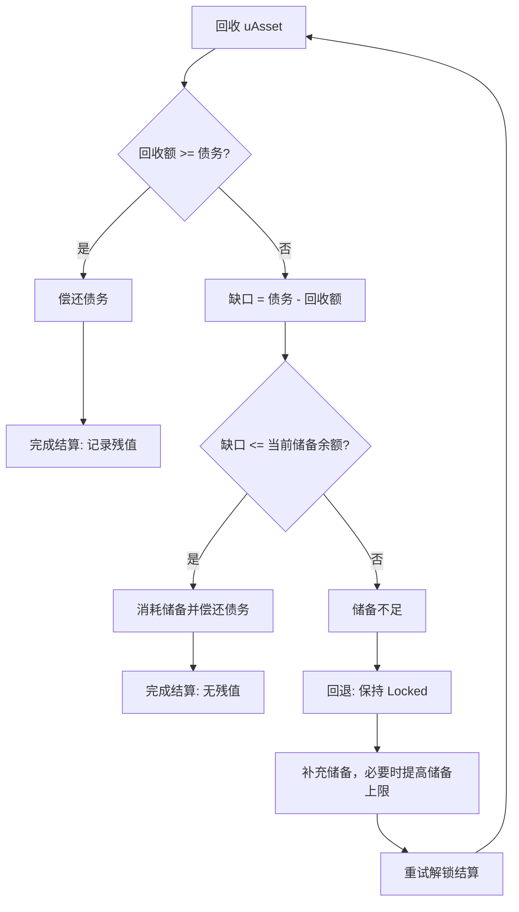

# 杠杆创世（POLend）

## 核心想法

普通参与创世，你存多少 uAsset，就占多少份额。杠杆创世让你**用一笔较小的成本，放大你的创世份额** —— 类似加了杠杆去参与早期。

具体做法：你支付一笔"利息"，协议据此给你一个更大的"债务额度"，这个额度会被铸成 uAsset 注入创世流动性，等于放大了你在这个 Memecoin 起步阶段的参与度和潜在回报。

## 两种付息方式

利息可以用两种东西支付：

- **uAsset 稳定币**：直接付真金白银。
- **创世积分（GenesisCredit）**：用空投获得的积分抵扣（详见 [创世积分](genesis-credit.md)）。

两种方式换到的创世份额一样，区别只在结算时利息的去向。

## 放大倍数由利率决定

协议设有一个全局默认**利率**，每个 Memecoin 注册时锁定当时的利率，之后固定不变。你付的利息按这个利率放大成债务额度：

- 债务额度 = 利息 ÷ 利率。
- 利率越低，同样利息换到的份额越大（杠杆越高）。
- 每个 Memecoin 都有**债务上限**，防止杠杆失控。

> 说明：这个利率是**一次性的创世利息比例**，不是年化利率 —— 你付一次利息，换一笔创世份额，不随时间累计。利率由协议设定，各 Memecoin 注册时固定。

## 到期怎么结算

创世达标并锁定期满后，进入结算：

1. 协议从辅助流动性池（POL、PT 池）回收 uAsset，用于偿还杠杆债务。
2. **若有结余**（回收的多于债务）：结余按每个人付的利息比例，分给杠杆参与者 —— 这是加杠杆的收益来源。
3. **若有缺口**（回收不足以偿债）：结算储备金只在该 uAsset 的当前余额内补足有上限的整数舍入缺口。若缺口超过储备余额，本次结算会回退、Verse 仍停留在锁定阶段；补充储备（必要时提高储备上限）后重试解锁结算。
4. 同时，杠杆参与者还会按比例分得 **YT**（收益代币，见 [POL 拆分](pol-splitter.md)）。

## 利息去了哪里

- 你付的 **uAsset 利息**：在创世锁定时归入**协议自留国库**（与 DAO 国库不同、非社区共治）—— 这是你的杠杆成本。
- 你付的 **创世积分**：在创世锁定时被销毁，退出流通。

## 失败则退款

如果创世未达标失败，你付的利息（无论 uAsset 还是积分）原路退还。加杠杆**没有筹资失败的本金风险**。

## 为什么没有清算风险

传统杠杆借贷靠预言机定价、靠清算维持抵押率，容易爆仓。Memeverse 的杠杆创世**不需要预言机、不需要抵押率维护** —— 它放大的是创世份额，结算由协议统一进行，不存在资不抵债被强平的场景。

## 举例

> 假设用户强烈看好某 Memecoin，用杠杆创世：支付 500 UUSD 利息，按当时利率（假设对应 5 倍放大）换得约 2500 UUSD 等值的创世份额。
> - Memecoin 达标锁定：500 UUSD 利息归协议自留国库（成本）。用户按付息比例（500 ÷ 全部杠杆利息）分得杠杆 YT。
> - 锁定期满结算：从辅助池回收资金偿债后若有结余，用户按同一比例分得残值。Memecoin 涨得越多，残值越丰厚。
> - 若 Memecoin 归零：用户损失这 500 利息，但不会被清算、不倒欠。
> - 若创世未达标：500 UUSD 全额退还。

杠杆创世让看好某个 Memecoin 的人，能用较低成本放大早期参与；代价是支付利息，收益来自结算结余和 YT。它和四池、POL 拆分一起，构成了 Memeverse 高资本效率的启动机制。
