# Leveraged Genesis (POLend)

## The core idea

With standard Genesis, your share matches the uAsset you deposit, one for one. Leveraged Genesis lets you **amplify your Genesis shares for a much smaller outlay**, as if entering the earliest stage with leverage.

How it works: you pay an "interest" amount, and the protocol grants you a larger "debt quota" in return. That quota is minted as uAsset and injected into Genesis liquidity, amplifying both your participation and your potential return in this Memecoin's earliest stage.

## Two ways to pay the interest

Interest can be paid in one of two forms:

- **uAsset stablecoins**: paid directly in actual funds.
- **GenesisCredit**: offset the interest with credits obtained from airdrops (see [GenesisCredit](genesis-credit.md) for details).

Both forms buy the same Genesis shares. The only difference is where the interest ends up.

The interest can also be paid by someone else: the payer covers the interest, and the leveraged shares are credited to a user you designate.

## The rate sets the amplification

The protocol maintains a global default **interest rate**. Every Memecoin locks in the rate current at its registration, and it stays fixed afterward. The interest you pay is scaled up into a debt quota at this rate:

- Debt quota = interest ÷ rate.
- The lower the rate, the more shares the same interest buys (the higher the leverage).
- Every Memecoin has a **debt cap** to keep leverage from running out of control.

> Note: this rate is a **one-time Genesis interest ratio**, not an annualized rate. You pay interest once, receive a block of Genesis shares, and nothing accrues over time. The rate is set by the protocol and fixed for each Memecoin at registration.

## What happens at settlement

Once Genesis reaches its target and the lock-up expires, settlement begins. Unlock and unified settlement run in a single transaction: if any step fails, the whole transaction reverts, the Verse (the Memecoin's launch instance) stays locked, and the process can be retried after reserves are replenished:

1. The protocol recovers uAsset from the auxiliary liquidity pools (the POL and PT pools) to repay the leveraged debt.
2. **If there is a surplus** (recovery exceeds the debt): the surplus is split among Leveraged Genesis participants in proportion to the interest each of them paid. This is where the return on leverage comes from.
3. **If there is a shortfall** (recovery cannot cover the debt): the settlement reserve covers only a capped integer-rounding shortfall, and only within the current balance of that uAsset. If the shortfall exceeds the reserve balance, the settlement reverts and the Verse stays in the Locked phase. After the reserve is replenished (raising the reserve cap if necessary), the unlock settlement is retried.
4. At the same time, Leveraged Genesis participants also receive a proportional share of **YT** (the Yield Token; see [POL split](pol-splitter.md)).

## Where the interest goes

- The **uAsset interest** you pay flows into the **protocol treasury** when Genesis locks (distinct from the DAO treasury and not community-governed). This is your cost of leverage.
- The **GenesisCredit** you pay is burned when Genesis locks, taken out of circulation.

## Refund if Genesis fails

If Genesis fails to reach its target, the interest you paid, whether uAsset or GenesisCredit, is refunded in full exactly as it was paid. Leverage carries **no principal risk from a failed raise**.

## Why there is no liquidation risk

Conventional leveraged lending relies on oracle pricing and liquidations to maintain the collateral ratio, and positions get wiped out when they slip. Memeverse's Leveraged Genesis **needs no oracle and no collateral-ratio maintenance**. What it amplifies is Genesis shares, and settlement is carried out by the protocol in one unified pass, so a position can never go underwater and get force-liquidated.

## Example

> Suppose a user is strongly bullish on a Memecoin and uses Leveraged Genesis: they pay 500 UUSD in interest and, at the then-current rate (assume it implies 5x amplification), receive about 2500 UUSD worth of Genesis shares.
> - The Memecoin reaches its target and locks: the 500 UUSD interest goes to the protocol treasury (the cost). The user receives leveraged YT in proportion to the interest paid (500 ÷ all leveraged interest).
> - Settlement when the lock-up expires: if a surplus remains after funds are recovered from the auxiliary pools to repay the debt, the user receives residual value in the same proportion. The more the Memecoin rises, the larger the residual value.
> - If the Memecoin goes to zero: the user loses the 500 UUSD interest, but is not liquidated and owes nothing further.
> - If Genesis misses its target: the 500 UUSD is refunded in full.

Leveraged Genesis lets anyone bullish on a Memecoin amplify their early participation at low cost. The cost is the interest paid; the return comes from the settlement surplus and YT. Together with the four pools and the POL split, it forms Memeverse's highly capital-efficient launch mechanism.
