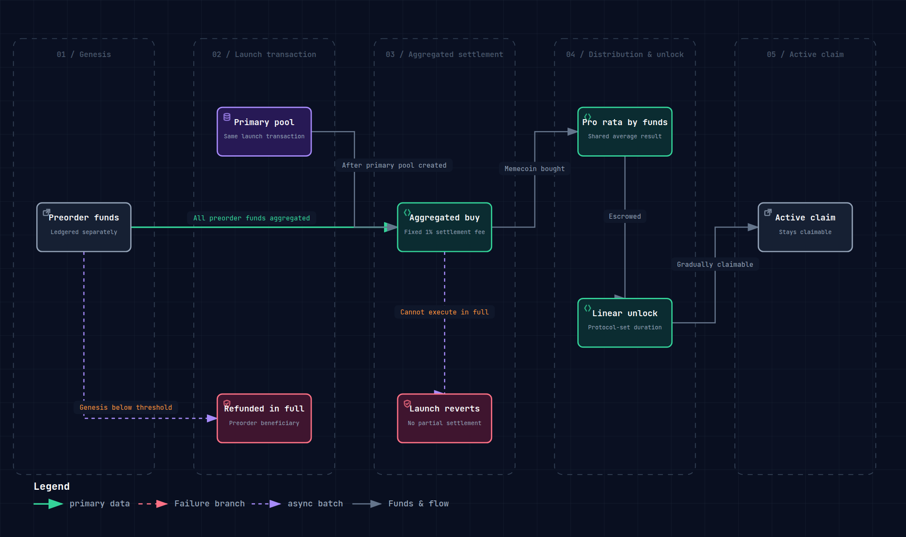

# Preorder

## What is Preorder

Preorder lets users lock in an early allocation and the distribution rights that follow **before** the Memecoin opens for trading. How much Memecoin each participant actually receives is only determined once the primary pool has been created and the aggregated settlement completes.

## How to participate

- During Genesis, users deposit uAsset to join the Preorder.
- Preorder has a **total capacity cap** and is first come, first served, so the preorder size cannot grow out of proportion to the primary pool.
- After the primary pool is created, the Preorder funds are swapped into Memecoin in a single transaction through a **dedicated settlement channel** (provided by the [hook](hook.md)) at a fixed low fee.

Total preorder capacity is calculated as:

```text
Total preorder capacity = (standard Genesis capital + leveraged debt principal) x 70% x preorder capacity ratio
```

The Preorder capacity ratio is configured globally by the protocol and capped at 100%. Preorder funds themselves do not count toward the capacity base.

## Settlement at a fixed fee rate

Unlike the dynamic fees of public trading, preorder settlement runs through the dedicated channel at a **fixed 1% total fee**, bypassing the dynamic fee schedule and the elevated fees at pool opening.

- All preorder uAsset is aggregated into the first exact-input AMM trade after the primary pool is created.
- Every Preorder participant pays the same 1% settlement fee rate, and the Memecoin bought by the aggregated trade is distributed in proportion to each participant's share of the Preorder funds.
- All participants share the average execution cost of that single aggregated trade; what is fixed is the settlement fee rate, not a pre-agreed Memecoin price.
- The amount the aggregated trade executes for is determined by the primary pool's initial reserves, the AMM curve, the total preorder size, and price impact.
- Settlement and primary-pool creation happen in the same launch transaction, so public trades cannot slip in between them.

No individual participant can set their own minimum output amount, price limit, or deadline. The net input, the aggregated funds after fees, must execute in full; if it cannot, the entire launch transaction reverts and no partial settlement occurs.



## Linear unlock

The Memecoin bought through Preorder does **not arrive all at once**; it **unlocks linearly** over time:

- During the unlock period, portions of the balance become claimable step by step.
- This encourages Preorder participants to hold rather than dump the moment the pool opens, reducing sell pressure.
- The unlock duration is configured by the protocol through a global parameter; any example duration is illustrative, not a fixed setting.

**You must claim it yourself**: unlocked Memecoin does not land in your wallet automatically. You can claim exactly what has unlocked so far, and you initiate the claim yourself in the interface. Check your claimable amount during the unlock period and claim it as it unlocks. Anything left unclaimed is retained, keeps accumulating, and does not disappear.

## Why Preorder matters

- **For users**: lock in a preorder allocation early, pay the same fixed 1% fee rate as everyone else, and share the average execution result of the aggregated trade.
- **For the project**: the pool opens with a cohort of holders committed through the lock-up, so the circulating supply trades more steadily and violent swings at the open are reduced.
- **For the market**: it limits sniping of the initial liquidity. The preorder aggregate buy is the primary pool's first trade: public trading cannot slip in between pool creation and the aggregate buy. Snipers cannot grab the opening position, and the starting price public traders face already includes the aggregate buy.

Preorder is part of Memeverse's fair-launch philosophy: those genuinely willing to participate early get priority, the first aggregate buy blocks the opening snipe, and the linear unlock restrains short-term arbitrage.

## Example

> During Genesis, a user preorders with 500 UUSD. After the primary pool is created, all users' preorder funds are aggregated into the first trade, which uniformly applies the **fixed 1% settlement fee rate**. The user receives a share of the Memecoin bought by the aggregated trade, in proportion to their 500 UUSD of the total preorder funds, and shares the same average execution cost as the other preorder participants. The exact amount depends on how the trade actually executes in the primary pool. The Memecoin bought does not arrive all at once; it **unlocks linearly** over a protocol-configured window (for example, 7 days). If the Memecoin's Genesis ultimately falls short of its target, the 500 UUSD is refunded to the beneficiary of that preorder record.
