# YT 闪电兑换（Flash Swap）

## 锁定期内的 YT 交易通道

Memeverse 不为 YT 设立独立的交易池，但锁定期内 YT 有交易通道：通过复用 PT/POL 池流动性的 **YT Flash Swap**，用 POL 买入 YT、或卖出 YT 换回 POL。通道始终可用，但**不代表任意数量都能成交**：可行性与成交价由执行时的池子状态决定（详见下文「保护与安全」）。整笔兑换在单笔原子交易内完成。换腿所需的资金由池子临时垫付、交易结束前归还，对用户不可见，所以叫"闪电"。

普通创世者和杠杆创世者在创世锁定后领到 **YT**（收益代币），但解锁结算前无法按份额赎回：想提前落袋的持有者、想中途上车的用户，都通过这条通道进出。

## 定价原理：YT = POL − PT

YT 的定价建立在一条铁律上：**1 个 POL = 1 个 PT + 1 个 YT**（拆分与合并都是 1:1）。

由此推出 YT 的隐含价格：

> **1 个 YT 的隐含价格（以 POL 计）= 1 个 POL − 1 个 PT 的市价**

这条关系是**理论推导**：基于 1:1 拆并，它说明 YT 的价值锚定在哪，但不等于你一定能按这个价格成交，真实成交价由执行那一刻的池子状态决定（详见下文「保护与安全」）。

PT/POL 池里 PT 有市价，YT 的隐含价格就随之确定，不必再为 YT 单独建池。PT 越接近 POL 平价（市场越看好本金兑付），YT 大体上越便宜；PT 折价越深，YT 大体上越贵。本质上，YT 是对**结算残值**（结算回收扣除 PT 本金准备后的剩余，详见 [POL 拆分](pol-splitter.md)）的市场定价。预期残值越高，YT 越贵。

## 买 YT（用 POL 买）

你指定要买 **y 个 YT**，并设一个最高支付上限。一笔原子交易内完成：

1. **卖出 y 个 PT 换 POL**：在 PT/POL 池按市价卖出 y 个 PT，换得一批 POL（记为 R）。此时这 y 个 PT 是"借"的：你手上还没有 PT，等于先欠池子 y 个 PT。
2. **拆分补齐**：你拿出 y 个 POL 去**拆分**（split），得到 y 个 PT + y 个 YT。这 y 个 POL 由两部分凑成：你实际掏的钱，加上步骤 1 卖 PT 得到的 R。
3. **归还借款**：用拆出的 y 个 PT 还掉步骤 1 欠池子的 PT 债。
4. **到手**：y 个 YT 给你。

**你实际掏的钱 = y − R**。直觉：完整拥有 y 个 YT 本需要 y 个 POL（拿去拆分），但拆出来的 y 个 PT 能卖回 R 个 POL 帮你分摊，所以你只需补上差额 y − R。PT 越值钱（R 越大），你要补的越少，YT 对你越便宜。

> 这就是"闪电"的含义：步骤 1 借入的 PT，在交易结束前（步骤 3）就已归还；要是中途算不平（比如费用、滑点让账对不上），**整笔交易原样回滚**，你的钱一分不动。

## 卖 YT（换成 POL）

你指定要卖 **y 个 YT**，并设一个最低收到下限。一笔原子交易内完成：

1. **买入 y 个 PT**：在 PT/POL 池花一批 POL（记为 Q）买回 y 个 PT。这批 POL 也是"借"的：等于先欠池子 Q 个 POL。
2. **合并变现**：把买来的 y 个 PT 和你的 y 个 YT **合并**（merge），变回 y 个 POL。
3. **归还借款**：从这 y 个 POL 里拿出 Q 个，还掉步骤 1 欠池子的 POL 债。
4. **到手**：剩余的 y − Q 个 POL 给你。

**你实际收到的钱 = y − Q**。直觉：要把 YT 变回 POL，得给每个 YT 配一个 PT 去合并；买这 y 个 PT 花了 Q 个 POL，合并出 y 个 POL，净落 y − Q。PT 越贵（买 PT 花的 Q 越大），你净得的越少。

## YT 是杠杆资产

买 y 个 YT，你只付了价差（y − R）这一小部分，却拿到 y 份**完整**的结算残值暴露。残值的每一丝变动，都会带来 YT 回报的大幅变动，这就是"做多 Memecoin 结算残值"的杠杆工具：看对了，收益被放大；看错了，亏损同样被放大，Memecoin 大跌、残值不足时 YT 归零。

## 费用：一次底层交易，一次费用

每笔 Flash Swap 只发生一次真实的底层 PT/POL 交易，因此只收一次费，没有额外的路由费或平台费，费率规则与普通 PT/POL 交易完全一致（动态费率、EWVWAP 豁免、65/35 分配、推荐返佣）。

但要注意杠杆的成本结构：费用按完整 PT 腿的成交规模计算，而你实际支付的本金只是价差。YT 越便宜（杠杆越高），同样费率相对你本金的比例越大。这是杠杆工具的成本，不是隐藏收费。

## 两种操作

| 操作 | 你指定什么 | 你得到什么 |
|---|---|---|
| 用 POL 买 YT | 精确的 YT 数量 + 最高支付上限 | 恰好那么多 YT，只扣实际成本 |
| 卖 YT 换 POL | 精确的 YT 数量 + 最低收到下限 | 至少下限那么多的 POL |

注意语义：买入是「精确拿到指定数量的 YT」，不是「花光预算买最多」。设了 100 的上限，若实际只需 60，剩余 40 留在你钱包，不会多买。

## 保护与安全

- **滑点与价格保护**：买入设最高支付上限，卖出设最低收到下限，还可设价格保护线、有过期时限，超出即整笔回滚。
- **报价仅供参考**：交易前看到的价格是基于当时链上状态的参考价，**不代表保证成交价**。实际成交价由执行那一刻的状态决定，可能更好、也可能更差：抢先交易（MEV）或市场变动都可能让成交价偏离参考价，只要没超过你设的保护线，交易仍会按更差的价格成交，超过则整笔回滚。大额订单建议设紧价格保护线、尽快成交。
- **单笔原子执行**：要么全部完成，要么分毫不差回滚 —— 不会出现「扣了钱没拿到 YT」或「YT 没了钱也没到」。
- **不预扣、不退款**：买入只拉取实际成本，上限只是护栏。
- **诚实失败**：受手续费、舍入、池子深度和容量影响，某些目标数量可能没有可行成交价，交易会直接回滚，重试或调整数量即可，不会产生损失。
- **会话前置**：钱包不是智能账户、未开启会话、或会话发起者与交易发起者不是同一钱包时，交易直接回滚，不会产生资金损失。
- **只走 POL**：通道只做 POL ↔ YT，不支持其他代币绕路中转。

## 谁能用、什么时候用

- **YT 持有者**（普通创世者、杠杆创世者）：锁定期间想提前落袋，可以卖出 YT。
- **看好的用户**：用 POL 买入 YT，等于用一小部分价格杠杆做多结算残值：Memecoin 结算表现越好，YT 越值钱；大跌则可能归零。
- 仅在该 Memecoin **锁定阶段**可用：解锁或结算后，拆分/合并关闭，Flash Swap 随之不可用，回到结算赎回规则。
- 交易须由**智能账户**发起。普通钱包（未部署合约代码的账户，如常见的浏览器插件钱包）无法直接完成这笔兑换，需使用 Safe 等智能账户钱包。整笔兑换在同一笔原子交易内「开启会话 → 执行兑换 → 关闭会话」三步完成，会话由前端自动包裹、对用户不可见；若未开启会话、或会话发起者与交易发起者不是同一钱包，交易会直接回滚，不会产生资金损失。这也是 Memeverse 交易层的统一要求。

## 和结算赎回的分工

Flash Swap 是锁定期内的**提前进出通道**，改变的是「什么时候能买卖 YT」，不改变结算规则：解锁结算后，YT 仍按份额分得剩余资产，Memecoin 归零则 YT 无收益。

## 举例

> 某 Memecoin 创世锁定后，PT 市价约 0.9 POL，YT 隐含价格约 0.1 POL。一位用户用 1,000 POL 买入 10,000 YT（设好最高支付额），等于花一小部分价格拿到 10,000 份结算残值的完整暴露：结算残值每比预期多 0.01 POL，他就多赚 100 POL（相对本金约 10%）；残值比预期少则亏损同样放大，Memecoin 大跌、残值降低时 YT 价值也会降低。
>
> 另一位持有创世 YT 的用户想趁热度落袋：设好最低收到额，卖出 10,000 YT。系统按市价买入等量 PT，与你的 YT 合并回 POL，扣除归还池子的部分后，把净得的 POL 转入用户钱包，全程一笔交易，成交价低于预期下限则自动回滚。
