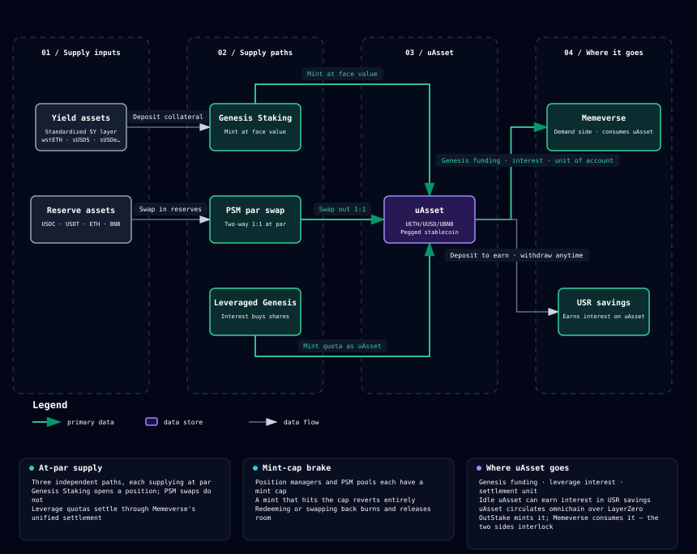

# uAsset: the pegged stablecoin

## What is uAsset?

**uAsset** is the unified stablecoin minted by OutStake. It comes in three types, each pegged to one underlying asset:

| uAsset | Peg | Underlying yield-bearing assets |
|---|---|---|
| **UETH** | ETH | wstETH and other ETH-family yield-bearing assets |
| **UUSD** | USD | sUSDS / sUSDe / aUSDC and other USD yield assets |
| **UBNB** | BNB | slisBNB / asBNB and other BNB-family yield-bearing assets |

**What the peg means: 1 uAsset always corresponds to the value of 1 unit of the underlying asset.** 1 UETH corresponds to 1 ETH of value, 1 UUSD to one US dollar, and 1 UBNB to 1 BNB. This correspondence is accounted for at face value: minting converts at the asset's full real-time value, redemption settles position debt pro rata, and swaps go both directions at par.

> Note: "stablecoin" here means **stable in value relative to the underlying asset**, not pegged to fiat. UUSD is a dollar stablecoin; UETH and UBNB are pegged to ETH and BNB, so their value moves with the underlying asset's price. They are stable tokens denominated in ETH or BNB, not fiat stablecoins.

## How the peg is maintained

uAsset has three supply paths, independent of one another:

- **Genesis Staking minting**: deposit a yield-bearing asset and uAsset is minted 1:1 with the asset's current value (wstETH worth 1 ETH → 1 UETH). Yield-bearing assets within the same family convert at their real-time values into the same uAsset, so liquidity stops being fragmented. See [Genesis Staking](staking-modes.md).
- **PSM reserve swaps**: swap reserve assets such as USDC, USDT, ETH, and BNB for uAsset and back, 1:1 at par. Each swap pool is backed unit for unit by reserves held by the protocol. See [PSM par swaps](psm.md).
- **Leveraged Genesis supply**: on the Memeverse side, the debt quota drawn for leveraged Genesis is also minted as uAsset and committed to Genesis, with the protocol settling it in one unified pass (see [leveraged Genesis](../memeverse/polend.md)).

## Mint caps prevent oversupply

Every position manager and every PSM swap pool has a **mint cap**: outstanding minted supply cannot exceed the configured amount. Minting takes up room under the cap; redemption (burning uAsset) releases it. This is one of the safeguards behind uAsset as a stablecoin: supply is capped, auditable, and cannot be minted without limit.

## Omnichain circulation

uAsset follows the **LayerZero OFT** standard and moves 1:1 across chains. You can mint UUSD on one chain and use it on another. See [Cross-chain and rate limits](omnichain.md).

## uAsset's role in the ecosystem

uAsset is not just an OutStake product; it is the medium of value for the entire Outrun ecosystem:

- **Memeverse Genesis funding**: uAsset supplies the liquidity injected when a Memecoin launches.
- **Leveraged Genesis interest**: when you take on leverage in Memeverse, interest is paid in uAsset.
- **GenesisCredit settlement**: GenesisCredit-based leverage is also denominated in uAsset.
- **USR savings**: idle uAsset can be deposited into the savings vault to earn interest (see [USR savings](usr.md)).

OutStake mints uAsset and it flows into Memeverse; that flow is the starting point of the ecosystem's capital cycle.

## Examples

> A user holds 5 wstETH (Lido), each worth about 1.05 ETH at the time, for a total of about 5.25 ETH. Through Genesis Staking on OutStake, they mint about 5.25 UETH (pegged to ETH). The wstETH collateral keeps earning inside the position and the exposure stays entirely with the user; returning the equivalent UETH redeems it whenever needed. Yield-bearing assets within the same family convert at their real-time values into the same UETH, so liquidity stops being fragmented.
>
> Another user holds only USDC: they swap it for UUSD at par through the PSM (minus a small swap fee) and join Memeverse Genesis directly, never opening a position along the way.
